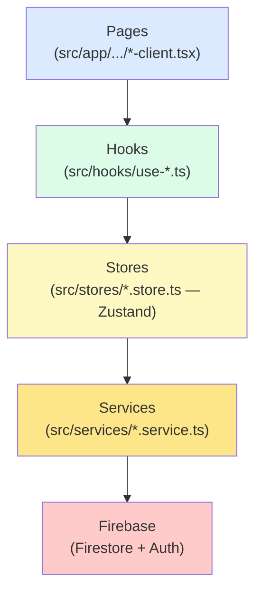
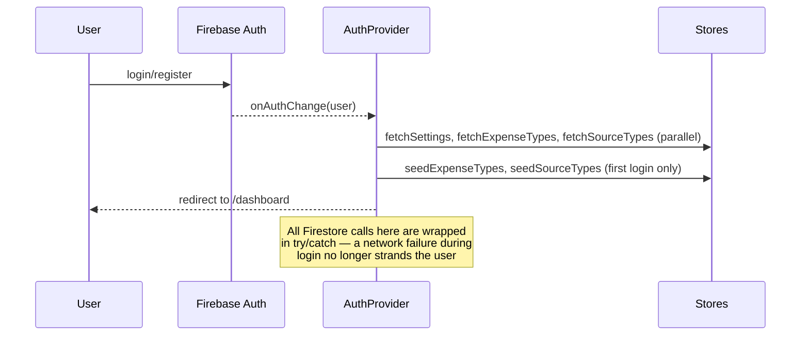

# 🏗️ Architecture

System design: tech stack, folder structure, and how the layers connect.

---

## Tech Stack

| Layer | Technology |
|---|---|
| Framework | Next.js 15 (App Router) |
| Language | TypeScript |
| Styling | Tailwind CSS + shadcn/ui |
| Animations | Framer Motion |
| Charts | Recharts |
| Forms | React Hook Form + Zod |
| State | Zustand |
| Backend | Firebase (Auth + Firestore) |
| Utilities | date-fns, Lucide React icons |

---

## The Layered Architecture

Every feature in this app follows the same five-layer flow. Data only ever
moves in one direction through these layers — a page never talks to Firebase
directly, and a service never imports a React hook.



**What each layer is responsible for:**

- **Pages** (`src/app/(dashboard)/*/​*-client.tsx`) — the actual screen. Reads
  from hooks, renders UI, calls store actions on user interaction (click,
  submit). Contains zero direct Firebase calls.
- **Hooks** (`src/hooks/use-*.ts`) — thin wrappers that trigger a store's fetch
  on mount (once per session, not on every render) and return the store's
  state/actions to the page. Examples: `useIncome()`, `useBankAccounts()`.
- **Stores** (`src/stores/*.store.ts`) — Zustand stores. Hold in-memory state
  for one domain (incomes, expenses, settings, etc). Call services, then
  update their own state with the result. This is where loading/error state
  lives.
- **Services** (`src/services/*.service.ts`) — the only files allowed to talk
  to Firestore directly. Pure functions: take plain data in, read/write
  Firestore, return plain data out. No React, no Zustand.
- **Firebase** — Firestore (per-user subcollections) + Firebase Auth.

---

## Folder Structure

```
src/
├── app/
│   ├── (auth)/                 Login, register, reset-password (public routes)
│   └── (dashboard)/            Every authenticated page, one folder per route
│       ├── dashboard/
│       ├── income/[id]/
│       ├── expenses/[id]/
│       ├── accounts/[id]/      Bank accounts (the newest major feature)
│       ├── transfers/
│       ├── spent-by/[id]/
│       ├── tags/
│       ├── analytics/
│       ├── timeline/
│       ├── search/
│       └── settings/
├── components/
│   ├── bank-accounts/          Account-specific UI (form, card)
│   ├── dashboard/               Stats cards, charts, overviews
│   ├── expenses/                Expense form, quick-add FAB
│   ├── income/                  Income form
│   ├── layout/                  Navbar, header, sidebar
│   ├── providers/                AuthProvider (session bootstrapping)
│   ├── shared/                   Reusable: modals, drawers, filters, selectors
│   └── ui/                       Toaster (generic UI primitives)
├── hooks/                       One hook per domain, thin store wrappers
├── lib/
│   ├── firebase/                 Firebase config, auth functions, collection paths
│   ├── utils/                    Currency formatting, date helpers, export, generic helpers
│   └── validations/              Zod schemas, one per form
├── services/                    All Firestore reads/writes live here
├── stores/                      Zustand state, one store per domain
└── types/index.ts                Every TypeScript interface/type in the app
```

---

## Authentication Flow



`AuthProvider` (`src/components/providers/auth-provider.tsx`) wraps the entire
app and is the single place session state is bootstrapped. New users get an
**empty settings document** (no currency pre-assigned) so the
`CurrencySetupBanner` can prompt them — existing users are untouched, since
this code path only runs once at signup.

---

## State Management Philosophy

Every Zustand store follows the same shape:

```ts
interface SomeStore {
  items: Item[];
  loading: boolean;
  error: string | null;       // always present since the "infinite retry" fix
  fetchItems: (userId) => Promise<void>;
  addItem: (userId, data) => Promise<string>;
  editItem: (userId, id, data, old?) => Promise<void>;
  removeItem: (userId, id) => Promise<void>;
}
```

**Important pattern:** `fetchX` always sets `loading: false` in BOTH the
success and the catch path. A store that leaves `loading: true` forever on
failure causes the consuming hook's "fetch if not already loading" guard to
retry forever. See `DEVELOPER_GUIDE.md` for the full list of patterns like this
that must never be violated.

---

## Where to go next

- For the financial logic (the actual "brain" of this app), read
  [`LEDGER_ENGINE.md`](./LEDGER_ENGINE.md) — this is the most important
  document in this folder.
- For the database schema, read [`DATABASE.md`](./DATABASE.md).
