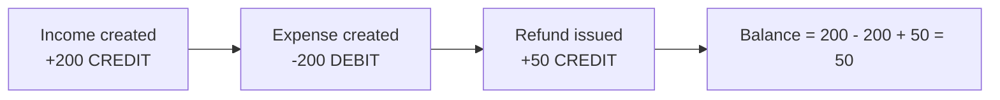
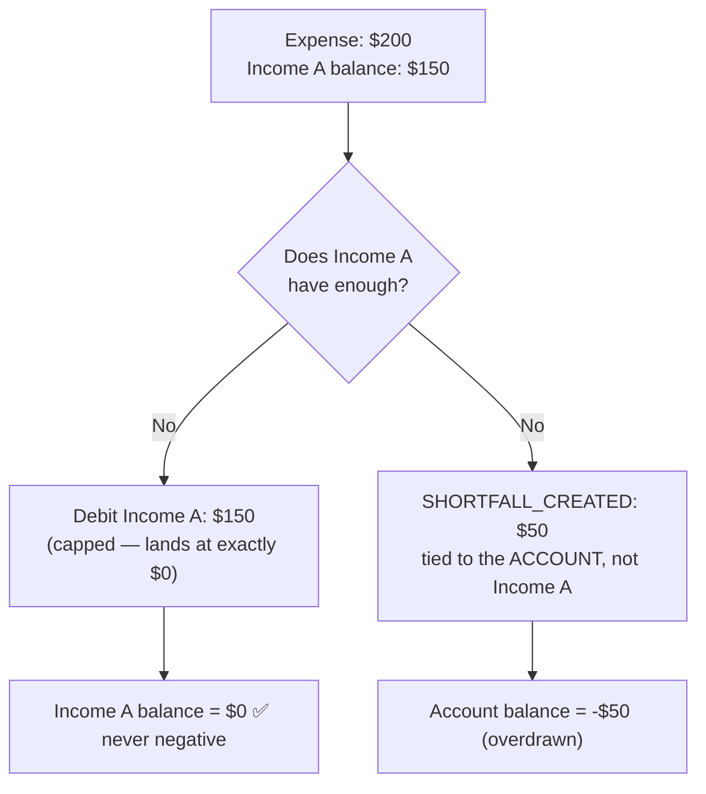
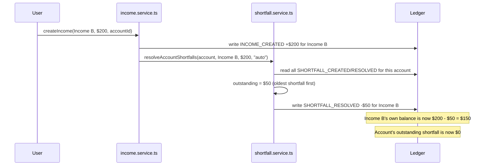
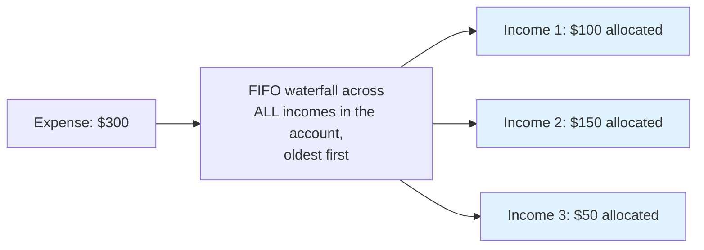

# 🧠 The Ledger Engine — How Money Actually Moves in This App

This is the most important document in this folder. Every financial bug this
project has ever had came from someone (including past versions of this
codebase) violating one of the rules described here. Read this before
touching `expense.service.ts`, `income.service.ts`, `bank-account.service.ts`,
or `shortfall.service.ts`.

---

## Rule #1: No balance is ever stored. Every balance is computed live.

There is no `income.balance` field in Firestore. There is no
`bankAccount.balance` field. An income document looks like
`{ name, amount, source, ... }` — `amount` is just "how much income was this,
originally." The actual *current balance* (after expenses, transfers,
refunds) is calculated, every time it's needed, by summing ledger entries:

```
balance = Σ(CREDIT entries for this income) − Σ(DEBIT entries for this income)
```

This single formula (`calculateBalanceFromLedger` in `ledger.service.ts`) is
the only place balance math happens. Every screen that shows a balance —
dashboard, income detail, account detail, analytics — ultimately calls this
same function on the same ledger data. There is no second formula anywhere
to get out of sync with the first.

## Rule #2: The ledger is append-only. Nothing is ever edited or deleted.

`firestore.rules` enforces `allow update, delete: if false` on the `ledger`
collection. **This is not a bug to "fix" — it's the foundation everything
else is built on.** If a $50 expense needs to be reversed, you don't delete
the original -$50 entry — you add a new +$50 entry. The full history of
every correction is always visible by reading the ledger from the start.



---

## The Bank Account Layer

A `BankAccount` doesn't hold money directly — it's a **grouping** of income
sources. An account's balance is the sum of every linked income's balance,
plus an optional opening balance, minus any outstanding shortfall:

```
accountBalance = Σ(linked income balances) + openingBalanceAdjustment − outstandingShortfall
```

This is computed in `bank-account.service.ts → computeAccountWithBalance()`.

---

## The Shortfall Engine — Why an Income Can Never Go Negative

This is the most important piece of business logic in the app, and the
hardest bug this project ever had to fix. Read this section slowly.

### The problem it solves

Imagine: Income A has $150. An expense for $200 is logged against it. Naively
debiting the full $200 from Income A would make its balance **−$50**. That's
wrong — an income source can't "owe" money. The $50 has to go *somewhere*,
but it can't make the income negative.

### The solution

When an expense is debited against an income **that's linked to a bank
account**, the debit is **capped at whatever balance that income actually
has.** Any amount beyond that becomes a separate ledger entry —
`SHORTFALL_CREATED` — tied to the **account**, not to any income.



**Income A's own ledger never sees more than $150 of debit. It is
mathematically impossible for it to go negative from this path.** The account,
however, correctly reflects that $50 is "owed" — exactly like a real bank
account overdraft.

### How a shortfall gets resolved

When a **new income** is added to the same account, the engine automatically
checks for outstanding shortfalls (oldest first) and applies the new income
to cover them:



This happens **automatically** inside `createIncome()` — wrapped in
try/catch so a resolution failure never blocks the income itself from being
saved. If it silently fails, the next `recomputeAccount()` call will catch up.

### Manual resolution

A user can also manually pick a *different existing* income (with spare
balance) to absorb a specific outstanding shortfall, instead of waiting for
a new one. Same underlying function
(`resolveAccountShortfalls(..., trigger: "manual", targetExpenseId)`),
just user-triggered and targeted at one specific shortfall instead of
"resolve everything oldest-first."

### "Recompute" — the safe catch-up button

`reconcileAccountShortfalls()` is a manual button (per-account, and
"Recompute All" across every account) that re-checks whether any of an
account's *current* income balances could cover an outstanding shortfall
that was never auto-applied (e.g. the auto-trigger failed once). **It can
only ever ADD new `SHORTFALL_RESOLVED` entries — never edit or delete
anything.** Running it when there's nothing to fix is a safe no-op.

### Where the outstanding shortfall number actually comes from

There is **no stored "shortfall total" field anywhere.** Just like every
other balance in this app, it's a live computation:

```
outstandingShortfall(account) = Σ(SHORTFALL_CREATED.amount) − Σ(SHORTFALL_RESOLVED.amount)
```

grouped per originating `expenseId` so partial resolution (a shortfall
covered 50% by one income, 50% by another) is tracked correctly.
See `shortfall.service.ts → getOutstandingShortfalls()`.

### What does NOT get this protection

If an expense has **no `accountId`** (i.e., it's not linked to a bank
account — the legacy/simple mode), it keeps the exact original, simple
behavior: one uncapped debit, full amount, no shortfall tracking. This is
intentional — the shortfall system only applies once a user opts into the
bank account feature.

---

## FIFO Attribution — Separate System, Display Only

There is a **second, completely separate** system called "attribution"
(`attribution.service.ts`) that answers a different question: *"which
income(s), in order, funded this expense?"* This is purely for showing the
user a breakdown — **it never writes to the ledger and never affects any
balance.** It writes to `expenseIncomeAllocations` only.



**Do not confuse this with the shortfall engine.** The shortfall engine
decides what actually happens to balances (one capped debit + one shortfall
entry). FIFO attribution is a cosmetic "here's how we'd explain this
expense" breakdown that can be safely deleted and recomputed at any time
with zero financial consequence.

`resolveFIFOPrimaryIncome()` is a lighter-weight helper used by the expense
*form* to pick which single income to target as the primary debit (oldest
income with any balance > 0) — this feeds INTO the shortfall engine, it
doesn't replace it.

---

## The Currency System

- Every `Income`/`Expense`/`Transfer` carries its own `currencyCode`.
  Older records that predate multi-currency support have no `currencyCode`
  at all — every read path falls back to the user's base currency
  (`settings.currencyCode`) when this field is missing.
- **A bank account's currency is locked forever at creation.** Any
  expense/income linked to that account MUST match its currency — enforced
  twice: visually (the form locks the currency field once an account is
  picked) and at the service layer (`assertCurrencyMatchesAccount()` throws
  a clear error and logs `BLOCKED_CURRENCY_MISMATCH` if anything ever tries
  to bypass the form).
- `formatFor(amount, currencyCode)` is the ONLY function that should ever be
  used to display a money amount. The other function, `format(amount)`,
  silently uses the user's base currency regardless of the amount's actual
  currency — this was the root cause of several historical bugs (amounts
  displayed in the wrong currency). **Never use bare `format()` for an
  amount that has its own `currencyCode`.**
- When the global currency filter is set to "All," the currency shown for
  charts is independently selectable via `ChartCurrencySelector` — it never
  silently sums different currencies together into one number.

---

## Quick Reference: What Each Service Owns

| Service | Owns |
|---|---|
| `ledger.service.ts` | The core balance formula, all ledger reads/writes |
| `income.service.ts` | Income CRUD, triggers shortfall auto-resolution on create |
| `expense.service.ts` | Expense CRUD, triggers capped-debit/shortfall-creation, currency guard |
| `bank-account.service.ts` | Account CRUD, balance aggregation, opening balance |
| `shortfall.service.ts` | The entire shortfall engine described above |
| `attribution.service.ts` | FIFO display-only matching (`expenseIncomeAllocations`) |
| `transfer.service.ts` | Moving balance between two incomes (same or cross-currency) |
| `audit.service.ts` | Security/compliance logging |
| `snapshot.service.ts` | Point-in-time monthly summaries (not yet wired to UI) |

For exact function signatures, see [`API_REFERENCE.md`](./API_REFERENCE.md).
