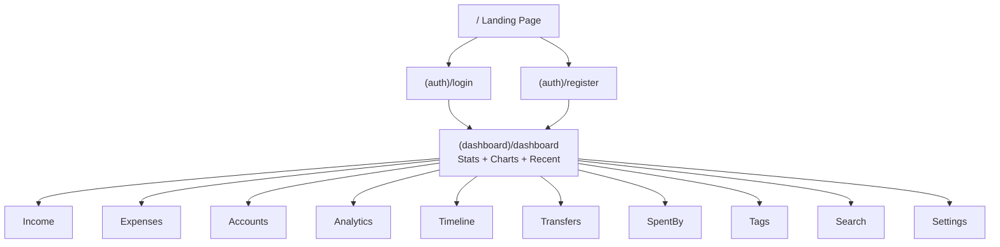
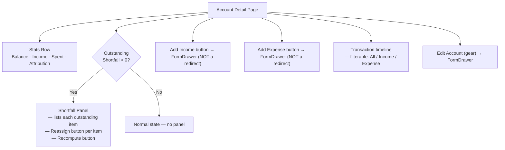

# 🗺️ UX Flows

Every page in the app and how users move through them.

---

## App Structure at a Glance



Every dashboard route is protected — `AuthProvider` redirects unauthenticated
users to `/login` before the page renders.

---

## Navigation

The app has three navigation surfaces:

**Sidebar** (desktop, always visible) and **Bottom navbar** (mobile) — both
show the same destinations: Dashboard, Income, Expenses, Accounts,
Transfers, Spent By, Tags, Analytics, Timeline, Search.

**Quick-Add FAB** (floating button, bottom-right, all dashboard pages) —
opens a radial menu with fast-create actions: Expense, Income, Account,
Transfer, Tag, Category, Income Type. Each opens a side drawer without
navigating away from the current page.

---

## Pages In Detail

### `/dashboard`

What it shows: summary stats (total income, total expenses, remaining
balance, spend rate), a monthly income vs. expenses bar chart, an expense
category pie chart, and a "Recent Transactions" list.

Filters available: **Global Currency Filter** (chip bar, shows when user has
2+ currencies in use — changes what all the stats/charts display).

The `CurrencySetupBanner` appears here (and only here) for brand-new users
who have not yet picked a base currency. Once they pick one it never
appears again.

The `MigrationBanner` appears for users who have incomes but no bank
accounts yet — offers to set up the bank account feature.

---

### `/income` and `/income/[id]`

**List page** (`/income`): grid of income cards, each showing name, source,
amount, current balance, and percentage used. Filtered by global currency.
"Add Income" button opens a side drawer with `IncomeForm`.

**Detail page** (`/income/[id]`): full stats for one income — original
amount, current balance, total expenses drawn, linked expenses list. Edit
and Delete buttons. Delete is guarded: throws an error if any expenses or
transfers reference this income (must be reassigned first).

---

### `/expenses` and `/expenses/[id]`

**List page** (`/expenses`): list of all expenses, most recent first,
filtered by global currency. "Add Expense" button opens side drawer.

**Detail page** (`/expenses/[id]`): full view of one expense — amount,
category, who spent it, income source, tags, notes. Three actions:

```
[Edit]  →  opens inline ExpenseForm inside the page
[Refund]  →  inline form: partial/full amount + reason → writes REFUND CREDIT
[Reassign]  →  dropdown of other incomes → moves the debit to a new income
[Delete]  →  confirm dialog → writes EXPENSE_DELETED CREDIT reversal
```

All four handlers are wrapped in try/catch — failure resets loading state
and shows a toast error.

---

### `/accounts` and `/accounts/[id]`

**List page** (`/accounts`): grid of bank account cards showing balance,
total income, total spent, attribution rate, and outstanding shortfall badge.
"New Account" button (also in FAB) opens a side drawer with `AccountForm`.
"Recompute All" button runs a safe catch-up reconciliation across every account.

**Detail page** (`/accounts/[id]`):



**The shortfall panel** shows only when `account.outstandingShortfall > 0`.
Each row represents one expense that had insufficient income to cover it.
Users can manually reassign it to any income in the same account with
balance > 0.

---

### `/transfers`

List of all transfers. **Global Currency Filter** applies (filters by
`fromCurrencyCode`). "New Transfer" button opens a form in a side drawer:

```
Select From Income (shows current balance) →
Enter Amount →
Select To Income →
Optional: exchange rate / to-amount for cross-currency →
Submit → writes DEBIT on From + CREDIT on To
```

Transfer notes are displayed in each row of the list.

---

### `/spent-by` and `/spent-by/[id]`

**List page**: grid of people. Total spent per person, per currency
(grouped, not mixed). Global currency filter applies.

**Detail page**: all expenses for one person with amounts, grouped
and displayed per currency using `MultiCurrencyAmount`.

---

### `/tags`

List of all tags. Per-tag: total expenses using that tag, per currency.
Same multi-currency grouping as Spent By. Edit and delete per tag.

---

### `/analytics`

The most data-dense page. Contains (top to bottom):

**Global Currency Filter + Chart Currency Selector** (when in "All" mode,
the chart selector lets you pick which currency to view charts in without
changing the overall app filter).

**Per-Currency Stats Cards** (when "All" mode: one row per currency).

**Monthly Trend Chart** — Income vs Expenses bar chart, last 12 months.

**Category Breakdown** — Pie chart of expense share by category.

**Spending by Person** — Bar chart per person.

**Tag Analytics** — Spend per tag.

---

### `/timeline`

Chronological feed of ALL transactions (incomes, expenses, transfers)
combined into one list, grouped by date. **Global Currency Filter applies** —
only events matching the selected currency are shown. Each event links to
its detail page.

---

### `/search`

Global search across all incomes, expenses, people, and tags. Runs
client-side on the already-loaded store data (no Firestore query per
keystroke). Results show amounts using each result's own `currencyCode`
(not the base currency).

---

### `/settings`

Two sections:

**Base Currency** — pick from a list of preset currencies or enter a custom
one. This is the fallback display currency for any transaction without its
own `currencyCode`.

**Extra Currencies** — add additional currencies you transact in. These
drive the global currency filter chip list.

**Attribution Mode** — Auto (FIFO runs silently) or Prompt Me (modal
should ask you to choose; this mode is currently partially implemented —
auto FIFO runs as fallback).

---

## Key UX Patterns Used Everywhere

**FormDrawer** — all "add/edit" forms open in a side panel that slides in
from the right. The page underneath stays mounted and visible. Body scroll
is locked while open. Multiple stacked drawers (e.g., a "+ New Tag" modal
inside an expense form) handled correctly by a `drawerCount` counter in
UIStore.

**ConfirmDialog** — destructive actions (Delete, Reassign) show a
confirmation modal before proceeding. The confirm button shows a loading
spinner during the async operation and resets correctly on failure.

**GlobalCurrencyFilter** — a row of chip buttons (All, USD, KWD, etc.)
that appears on every page with multi-currency data. Built from the union
of configured currencies AND currencies actually present in transaction
data, so it appears even if a user never went to Settings to configure a
currency explicitly.

**MultiCurrencyAmount** — a display component that renders one line per
currency (e.g., "KD 200.000 / $150.00") instead of mixing currencies
into a single wrong number. Used on Spent By, Tags, and anywhere "All"
mode could contain mixed currencies.

**Toast system** — every async action (create, update, delete, recompute,
resolve shortfall) resolves with either a success toast or an error toast
showing the actual error message. No silent failures in the UI.
